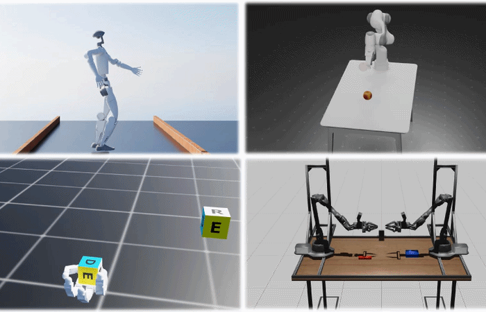

<p align="center">
  
</p>

<p align="center">
  🌐 <a href="https://haoxiangyou.github.io/sdpg-website/">Project Website</a>
  &nbsp;·&nbsp;
  📄 <a href="https://arxiv.org/abs/2605.26478">arXiv</a>
</p>

<p align="center">
  
</p>

**SDPG** is a lightweight visual reinforcement learning method that trains diverse visuomotor control policies end-to-end within a few hours on a single NVIDIA RTX 4080 GPU. It estimates policy gradients from random perturbations of trajectory rollouts, requiring orders of magnitude fewer batch-rendered environments and substantially reducing compute and memory overhead. On visual MuJoCo benchmarks, SDPG matches state-based performance while training faster and using less memory than prior end-to-end methods, and transfers to physical hardware.

This repository is the official implementation of [*Efficient On-policy Visual-RL via Stochastic Decoupled Policy Gradient*](https://haoxiangyou.github.io/sdpg-website/).

## 1. Installation

### 1.1 Setup

```bash
conda create -n SDPG python=3.11
conda activate SDPG

pip install -e ".[dev]"

# Optional: install Genesis in editable mode 
pip install -e "externals/Genesis[dev]"
```


For developer, install the git hooks so ruff runs on commit:

```bash
pre-commit install        # enable hooks on git commit
```

Run manually on all files: `pre-commit run --all-files`

### 1.2 Other dependencies

<details>

Vendored third-party packages (e.g., `rl_games`, `drqv2`) are included under `externals/` for running baselines. See [`externals/README.md`](externals/README.md) for pinned versions and local patches.

</details>

## 2. Training

### 2.1 Quick Start

Training is launched via Hydra. Override `task` and `agent` to select the environment and algorithm. SDPG configs are provided for both state-based and vision-based observations.

State-based:

```bash
python scripts/run.py task=genesis/hopper agent=sdpg/genesis_hopper
```

Vision-based (override `vis_obs=True` so the env generates images each step, and use the `_vis` agent config):

```bash
python scripts/run.py task=genesis/hopper task.config.vis_obs=True agent=sdpg/genesis_hopper_vis
```

Logs are written to `logs/<backend>/<task>/<agent>/train/<timestamp>/`.

### 2.2 Visualization during training

<details>

To open the Genesis viewer during training, add `task.config.show_viewer=True`.

By default the viewer renders all environments, which can slow down training. Limit it with `task.config.vis_options.rendered_envs_idx='[id_1, id_2, ...]'`.

Environments are laid out in a grid separated by `env_spacing` (set in `build_scene()`), with `id=0` at the far corner. For SDPG the total count is `num_base_envs * (num_action_perturbations + 1)` — e.g., 64 * 64 = 4096 environments, with the grid center around `id=2048`.

</details>

## 3. Evaluation

Set `train=False` and point to a checkpoint:

```bash
python scripts/run.py task=genesis/hopper agent=sdpg/genesis_hopper train=False checkpoint=<path_to_checkpoint>
```

Checkpoints are saved at `logs/<backend>/<task>/<agent>/train/<timestamp>/training_logs/nn/<name>.pt`.

Use the same `task` and `agent` configs as training. For example, to evaluate a vision-based policy:

```bash
python scripts/run.py task=genesis/hopper task.config.vis_obs=True agent=sdpg/genesis_hopper_vis train=False checkpoint=<path_to_checkpoint>
```

Control the number of evaluation environments with `task.play.num_envs=N` (more environments may slow down the visualizer and requires more GPU memories).

### 3.2 Remote evaluation and local replay

<details>

To evaluate headlessly on a remote server, set `task.play.show_viewer=False`. Evaluation saves a `trajectory.pt` file under `logs/.../eval/`.

To replay the saved trajectory locally with the Genesis viewer:

```bash
python scripts/replay.py task=genesis/hopper traj_path=<path_to_trajectory.pt>
```

Optional overrides:

- `num_envs=8` — override the number of environments to replay (defaults to the trajectory's batch size)
- `max_frames=500` — cap the number of timesteps

</details>

## 4. Custom Environments

See [`envs/genesis_env/README.md`](envs/genesis_env/README.md) for a step-by-step guide on adding new environments.

## 5. Additional Simulation Backends

Coming soon.


## 6. Hardwares

Coming soon.

## 7. Citation

If you find this work useful, please cite:

```bibtex
@misc{you2026efficientonpolicyvisualrlstochastic,
      title={Efficient On-policy Visual-RL via Stochastic Decoupled Policy Gradient}, 
      author={Haoxiang You and Yilang Liu and Davis Zong and Qian Wang and Teeratham Vitchutripop and Qi Wang and Daniel Rakita and Ian Abraham},
      year={2026},
      eprint={2605.26478},
      archivePrefix={arXiv},
      primaryClass={cs.RO},
      url={https://arxiv.org/abs/2605.26478}, 
}
```